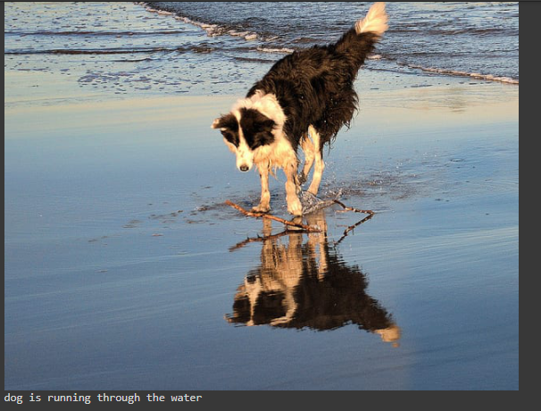

# Image-Captioning

Image Captioning is done using CNNs and LSTMs

* Descriptions are embedded into word vectors and passed into LSTM
* Images are converted into feature vectors using a CNN (VGG16 model is used here)
* These 2 are passed as inputs and then merged together and connected to a Dense Layer to give the output

# Model Intuition:

# Model Structure:

# OUTPUT:

